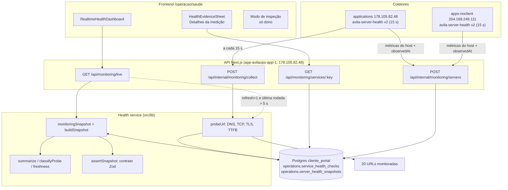
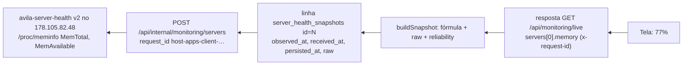

# Saúde em tempo real — auditoria e rastreabilidade

Tela: `https://app.avilaops.com/operacao/saude`
Auditoria e implementação: 16/09/2026.

Regra da tela: nenhum número aparece sem que se possa responder "qual evidência produziu este valor?". Clicar em qualquer número abre **Detalhes da medição** com origem, horários, fórmula, código, dados brutos e frescor. O dono tem ainda o modo **Inspecionar dados** (botão, ou `?debug=health`).

---

## 1. Arquitetura

### Antes (encontrado em 16/09/2026)

- `src/app/operacao/saude/page.tsx` → `monitoringSnapshot(false)` (só leitura do banco).
- `src/components/RealtimeHealthDashboard.tsx`: componente único. Calculava os totais e a média **no navegador**.
- `src/lib/monitoring.ts`: lista de serviços fixa, probe com `fetch`, gravação e montagem da resposta.
- `GET /api/monitoring/live?refresh=1`, chamado pela tela a cada 5 s: **cada aba aberta disparava 20 testes e 20 gravações**.
- `POST /api/internal/monitoring/servers`: recebia CPU, memória etc. do host e **carimbava `collectedAt = new Date()` no backend**.
- `POST /api/internal/monitoring/collect`: rodada de testes chamada pelo host `apps-client`.
- Hosts: `/usr/local/bin/avila-server-health` + `avila-monitoring.timer` (15 s) no 178.105.82.48 e no 204.168.249.111.
- Tabelas: `operations.service_health_checks` e `operations.server_health_snapshots`, retenção de 24 h.
- Não havia Prometheus, Grafana, Redis, WebSocket ou SSE.

### Depois

Caminho inverso de um número (ex.: "Memória 77%" do servidor applications):

---

## 2. Mapa frontend → backend → coleta

| Campo na tela | Componente / variável | Origem imediata | Função | Fonte original | Transformação | Persistência | Frequência |
|---|---|---|---|---|---|---|---|
| Saudáveis | `summary.healthy` | `GET /api/monitoring/live` | `summarize()` em `src/lib/health/classify.ts` | `service_health_checks` (último check de cada serviço) | conta status HEALTHY com leitura ≤ 45 s | não (derivado) | a cada resposta |
| Com atenção | `summary.slow` | idem | idem | idem | conta SLOW com leitura atual | não | idem |
| Indisponíveis | `summary.down` | idem | idem | idem | conta DOWN com leitura atual | não | idem |
| N sem leitura atual (novo, só aparece se > 0) | `summary.unknown` | idem | idem | idem | sem check ou check > 45 s | não | idem |
| Resposta média | `summary.averageLatency` | idem | idem | `latency_ms` do último check | média simples de HEALTHY/SLOW atuais | não | idem |
| CPU % | `servers[].cpu` | idem | `buildSnapshot()` | host: `top -bn2 -d .2` | `100 − %idle` | `server_health_snapshots.cpu_percent`, `raw.cpu_idle` | 15 s |
| Memória % | `servers[].memory` | idem | idem | `/proc/meminfo` | `(MemTotal − MemAvailable) / MemTotal × 100` | `memory_used_percent`, `raw.mem_*` | 15 s |
| Disco % | `servers[].disk` | idem | idem | `df -P /` | coluna Use% (só `/`) | `disk_used_percent`, `raw.disk_*` | 15 s |
| MB livres | `servers[].memoryAvailableMb` | idem | idem | `/proc/meminfo` | `MemAvailable / 1024` | `memory_available_mb` | 15 s |
| Swap % | `servers[].swap` | idem | idem | `/proc/meminfo` | `(SwapTotal − SwapFree) / SwapTotal × 100` | `swap_used_percent` | 15 s |
| N containers rodando | `servers[].containers.running` | idem | idem | `docker ps -q` | contagem | `containers_running` | 15 s |
| parados / unhealthy / existentes | `containers.stopped/unhealthy/total` | idem | idem | `docker ps -aq`, `--filter health=unhealthy` | contagem; parados = existentes − rodando | `containers_*` | 15 s |
| há Xs (servidor) | `servers[].cpu.observedAt` | idem | tela: `ageText()` com offset de relógio | relógio do host (`date -u`) | agora(servidor) − observedAt | `observed_at` | 1 s (contador) |
| Status do serviço (bolinha e texto) | `services[].status` | idem | `classifyProbe()` | `probeUrl()` no app | regra da seção 5 | `service_health_checks.status` | 15 s (timer) ou 5 s (tela) |
| ms do serviço | `services[].latency` | idem | `probeUrl()` | início do probe → cabeçalhos da resposta final | medido | `latency_ms`, `dns_ms`, `connect_ms`, `tls_ms`, `ttfb_ms` | idem |
| há Xs (serviço) | `services[].check.checkedAt` | idem | `ageText()` | hora de início do probe | agora(servidor) − checkedAt | `checked_at` | 1 s (contador) |
| Sparkline | `services[].history` | idem | `buildSnapshot()` | últimos 30 checks em 30 min | linha quebra em DOWN (marca vermelha) | `service_health_checks` | a cada resposta |
| Mensagem de erro | `services[].check.errorCode` | idem | `probeUrl()` | código do Node (`error.code`) | nenhuma | `error_code`, `error_category`, `error_message` | idem |
| Detalhes: falhas seguidas, última falha/recuperação | painel | `GET /api/monitoring/services/:key` | `analyzeHistory()` | 24 h de checks | varredura do histórico | não (derivado) | ao abrir |

---

## 3. Fórmulas e regras (centralizadas)

Tudo em `src/lib/health/config.ts` e `src/lib/health/classify.ts`, versão `health-v2`.

| Regra | Valor |
|---|---|
| Intervalo de coleta dos hosts | 15 s (`avila-monitoring.timer`) |
| Dado desatualizado (stale) | > 45 s (3 intervalos) |
| HEALTHY | HTTP 2xx em até 2500 ms |
| SLOW ("Com atenção") | HTTP 2xx acima de 2500 ms |
| DOWN | erro de rede, DNS, TLS, timeout (8 s) ou HTTP fora de 2xx |
| UNKNOWN | sem check, ou check com mais de 45 s |
| Resposta média | média simples da última latência de cada serviço com leitura atual e status HEALTHY ou SLOW. DOWN (inclui timeout) e desatualizados ficam fora, porque o tempo medido numa falha é o tempo até o erro. Sem serviço elegível, mostra "-" (nunca 0). |
| Latência | início do probe → cabeçalhos da resposta final, incluindo DNS, TCP, TLS e até 5 redirecionamentos. O corpo não é baixado. Conexão nova a cada check (sem keep-alive). |
| Nova medição pela tela | só se a última rodada tiver ≥ 5 s; uma rodada por vez por processo |
| Limites das barras | CPU 70/90 %, memória 75/90 %, disco 75/90 % |
| Hospedagem pelo DNS | IP resolvido = IP de um servidor → comprovado; faixa da Cloudflare → origem não comprovável; outro IP → externo |

## 4. Frequência e retenção

- Hosts: um snapshot a cada 15 s por servidor, cerca de 5.760 linhas por servidor por dia.
- Checks: 20 serviços a cada 15 s pelo timer, mais rodadas da tela limitadas a uma a cada 5 s. No pior caso (tela sempre aberta), 20 × 12/min ≈ 345 mil linhas por dia; só com o timer, 115 mil. Antes do limite de 5 s, cada aba aberta somava mais 20 linhas a cada 5 s.
- Retenção: 24 h nas duas tabelas. A limpeza roda em ~2% das rodadas (aleatório de propósito, para não fazer um DELETE a cada 15 s). Medido em 16/09: 106 mil checks, 33 MB.
- Cardinalidade: sem rótulos livres (serviço × tempo), então cresce de forma linear e previsível.

---

## 5. Dados suspeitos encontrados

Não foi encontrado mock, `Math.random` gerando valor exibido nem array de números inventados. Estes eram os pontos que apresentavam mais certeza do que tinham:

| Arquivo:linha (antes) | Dado | Comportamento | Risco | Situação |
|---|---|---|---|---|
| `api/internal/monitoring/servers/route.ts:30` | "há Xs" dos servidores | `collectedAt: new Date()`: hora de chegada, não da medição | Alto | **Corrigido**: coletor v2 envia `observedAt`; v1 aparece como ESTIMADO |
| `lib/monitoring.ts:4-23` | servidor de cada serviço | rótulo fixo, nunca verificado. Fênix está listado em "aplicações", mas o DNS aponta para 191.252.51.32 (externo) | Alto | **Exposto**: IP resolvido a cada check e aviso "DNS aponta para fora deste servidor" |
| `RealtimeHealthDashboard.tsx:11` | sparkline | `latencyMs ?? 0`: falha desenhada como 0 ms | Médio | **Corrigido**: linha quebra e marca vermelha |
| `RealtimeHealthDashboard.tsx:59` | resposta média | incluía DOWN (ex.: 494 ms de handshake TLS recusado) | Médio | **Corrigido**: regra explícita, DOWN fora |
| `RealtimeHealthDashboard.tsx:55-58` | totais | `UNKNOWN` não entrava em nenhum grupo, a soma podia dar menos que 20 | Médio | **Corrigido**: grupo "sem leitura atual" |
| `RealtimeHealthDashboard.tsx:39` + `monitoring.ts:76` | medição pela tela | cada aba disparava 20 testes a cada 5 s | Médio | **Corrigido**: rodada < 5 s reaproveitada, uma por vez |
| `RealtimeHealthDashboard.tsx:66` | texto "leituras a cada 5 segundos" | só valia com a aba aberta | Baixo | **Corrigido**: texto diz 5 s com a tela, 15 s sem |
| `RealtimeHealthDashboard.tsx:30,51` | contador | misturava relógio do servidor e do navegador | Baixo | **Corrigido**: offset do relógio do servidor |
| `footer` do servidor | "25 containers" | só os em execução, sem dizer | Médio | **Corrigido**: "rodando", mais parados, unhealthy e existentes |
| `lib/monitoring.ts:68` | retenção | limpeza com `Math.random() < 0.02` | Baixo | Mantido e documentado (afeta só a limpeza) |

## 6. Inconsistências e riscos

- **CPU com janela de ~200 ms** (`top -bn2 -d .2`): é uma foto, não uma média. Varia muito entre leituras. Mantido (não inventar outra métrica), mas a fórmula está exposta no painel.
- **Disco só de `/`**: volumes montados em outro ponto não entram.
- **Probe sai do servidor applications**: serviços hospedados nele medem quase só loopback (ex.: Site Ávila Ops ~11 ms). Não representa a latência de um cliente externo.
- **CRM, Lojas, Mello e Sorroche** passam pela Cloudflare: o servidor de origem não é comprovável pelo DNS.
- **Fênix Eletrodos** (16/09/2026): o certificado entregue é `CN=*.websiteseguro.com`, sem cadeia intermediária e sem cobrir `fenixeletrodos.com.br` (`openssl`: `Verify return code: 21`). O DOWN é real. Hospedagem externa (191.252.51.32), não o servidor de aplicações.
- **n8n**: listado como apps-noclient, e hoje o DNS confirma 204.168.249.111. Se a migração para o applications acontecer, a tela vai mostrar o aviso de divergência até `MONITORED_SERVICES` ser atualizado.
- **Relógio do host**: se divergir mais de 5 min do backend, `observedAt` é descartado e a leitura vira ESTIMADO (registrado em log `server_clock_skew`).

---

## 7. Mudanças realizadas

- `src/lib/health/config.ts`: constantes, limites, servidores, lista de serviços.
- `src/lib/health/classify.ts`: `classifyProbe`, `errorCategory`, `hostingOf`, `freshness`, `summarize`, `analyzeHistory`, `capacityLevel`.
- `src/lib/health/probe.ts`: probe com `node:https`, fases DNS/TCP/TLS/TTFB, IP resolvido, redirecionamentos, erro original.
- `src/lib/health/snapshot.ts`: `buildSnapshot()` puro, com proveniência em cada número.
- `src/lib/health/schemas.ts`: contrato Zod, `assertSnapshot` (recusa mock em produção), `serverIngestSchema`, `sanitize`.
- `src/lib/health/request.ts`: request id.
- `src/lib/monitoring.ts`: coleta com request id e trigger, limite de 5 s, log JSON, `serviceDetail()`.
- APIs: `live` (request id, validação), `servers` (Zod, `observedAt`, raw, IP de origem), `collect` (request id), nova `services/[key]`.
- Tela: números clicáveis, `HealthEvidenceSheet`, modo de inspeção, sparkline sem zero falso, contadores por hora real, avisos de desatualizado e de hospedagem.
- Migração `20260916180000_health_provenance`: só colunas novas e anuláveis. Linhas antigas ficam com `persisted_at` NULL (não recebem a hora da migração).
- Coletor `scripts/server-health-collector.sh` v2: `observedAt`, raw, containers existentes e parados, hostname, versão, request id.

## 8. Endpoints

| Endpoint | Autenticação | Uso |
|---|---|---|
| `GET /api/monitoring/live[?refresh=1]` | sessão admin | dados da tela; devolve `x-request-id` |
| `GET /api/monitoring/services/:key` | sessão admin | últimos 20 checks, falhas seguidas, última falha e recuperação (24 h) |
| `POST /api/internal/monitoring/servers` | `Bearer MONITORING_INGEST_TOKEN` | métricas do host |
| `POST /api/internal/monitoring/collect` | `Bearer MONITORING_INGEST_TOKEN` | rodada de testes (timer do applications) |

## 9. Schemas

`src/lib/health/schemas.ts`:

- `HealthMeasurement<T>`: `value`, `unit`, `status`, `observedAt`, `receivedAt`, `persistedAt`, `source` (`type`, `server`, `host`, `collector`, `collectorVersion`, `metric`, `endpoint`), `calculation` (`type`, `formula`, `code`, `version`), `reliability` (`state`: live, stale, missing, estimated, cache, fallback, mock; `stale`, `ageMs`, `staleAfterMs`, `note`), `raw`, `transport`.
- `snapshotSchema`: `meta` (request id, endpoint, duração, modo de coleta, commit, versões, limites), `summary`, `servers[]`, `services[]`.
- Medição sem `source`, sem `observedAt` (a chave precisa existir; `null` só com estado `estimated`/`missing`) ou sem `reliability` não passa no parse, e a API responde 500.

## 10. Testes

`tests/unit/health-classify.test.ts` e `tests/unit/health-snapshot.test.ts` (27 testes):

- HEALTHY, SLOW e DOWN (HTTP fora de 2xx, erro TLS, timeout).
- Categorias de erro sem trocar o código original.
- Média de latência (só HEALTHY/SLOW atuais; DOWN e timeout fora; null quando ninguém entra).
- Totais somam o total de serviços; desatualizado vai para "sem leitura".
- Dado stale detectado; horário ausente é `missing`, nunca `live`.
- Hora original da coleta preservada (`observedAt`, `receivedAt`, `persistedAt`).
- Proveniência (origem, fórmula, raw) chega à resposta.
- Coletor v1 vira ESTIMADO e containers parados "SEM FONTE COMPROVADA".
- Mock aceito em desenvolvimento e recusado em produção.
- Contrato recusa medição sem origem ou sem horário.
- Ingestão aceita coletor v1 e v2; sanitização remove tokens.

## 11. Ainda sem comprovação

| Dado | Por quê | Como coletar |
|---|---|---|
| Servidor de origem de CRM, Lojas, Mello, Sorroche | proxy Cloudflare esconde o IP | header de identificação da origem no Caddy de cada host (ex.: `X-Served-By`) lido pelo probe |
| Latência vista por um cliente externo | o probe sai do servidor applications | segundo ponto de medição fora dos dois servidores |
| CPU média no intervalo | `top` mede ~200 ms | `/proc/stat` com delta entre duas coletas de 15 s |
| Disco de outros volumes | só `df /` | `df -P` com lista de pontos de montagem |
| Leituras de hosts anteriores ao coletor v2 | sem `observedAt` nem raw | aparecem como ESTIMADO até saírem da janela de 30 min |
| Checks anteriores ao probe v2 | sem IP, fases e mensagem | aparecem com nota "probe v1"; somem em 24 h |
