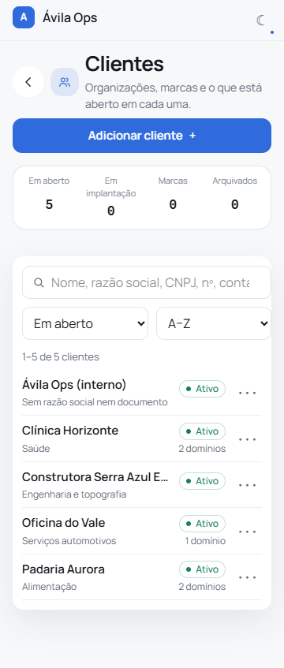
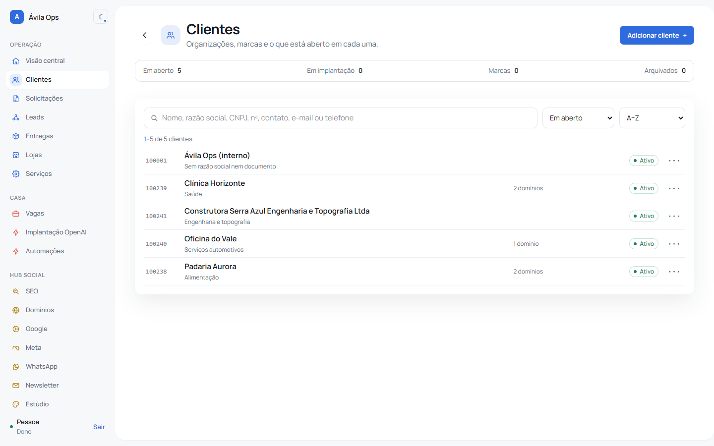
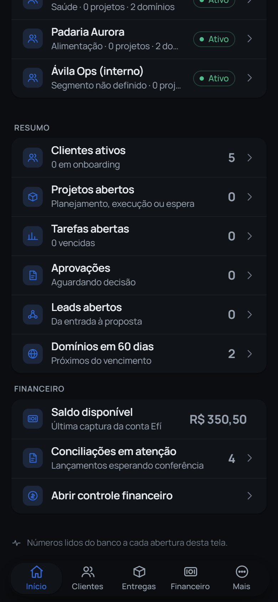
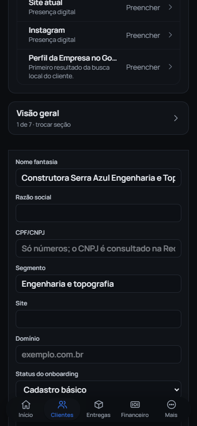

# Validação final da densidade — PR #55

Conferência em 01/10/2026, sobre o código final de `85339e0`, com a main `e33eded`
incorporada. Os ajustes de clientes e cadastro que já chegaram à main foram
preservados: o diff restante mantém os tokens atuais, compacta os espaçamentos
maiores no celular, reduz a altura inicial dos textos multilinha e permite ler
as explicações do cadastro assistido.

## Resultados

- Lint: nenhum erro; sete avisos preexistentes.
- `npx tsc --noEmit`: passou.
- `npm test`: 527 testes, 45 arquivos, todos passaram.
- `npm run build`: passou com heap de 4 GB. Permanecem os avisos de abrangência
  de arquivos de armazenamento do Turbopack; não foram ocultados.
- Build de produção local em PostgreSQL descartável, com `scripts/prints/semear.ts`.
- Operação, clientes, projetos, vagas, implantação e Mais: temas claro e escuro,
  larguras 360, 390, 768 e 1440 px. 48 combinações, sem erro de console, corte
  horizontal ou conteúdo final encoberto pela navegação inferior.
- Cadastro assistido a 390 px: o botão de preenchimento leva ao campo e mantém
  o foco. A inspeção revelou o fundo branco do seletor no tema escuro; o seletor
  e a barra de salvar agora usam o token de superfície que existe nos dois temas.
- Após a correção, a ficha de cadastro também passou nas oito combinações de
  largura e tema, sem problemas. O build foi repetido e aprovado nesse código.

O roteiro usado foi `docs/prints/financeiro/conferir.mjs` da branch do #61,
apontado para o build independente do #55. A captura de página inteira omite
apenas a barra fixa para não desenhá-la no meio da página; a captura `-fim`
mostra a barra real e verifica o último elemento visível.

## Evidências

As imagens desta pasta mostram o #55 isoladamente. A marca oficial e os novos
ícones estão no #61, que incorpora o #55 e deve ser integrado depois dele.
Os nomes e valores são fixtures; não houve operação em produção. Emulação de
Chromium não substitui a conferência em iPhone físico.

## Integração

A execução anterior do GitHub Actions estava bloqueada por cobrança/limite da
conta. Em 01/10, após atualizar a branch, o runner voltou a executar os jobs.
Os resultados locais não substituem os checks exigidos: o merge depende dos
checks verdes no head final, visíveis no próprio PR.
