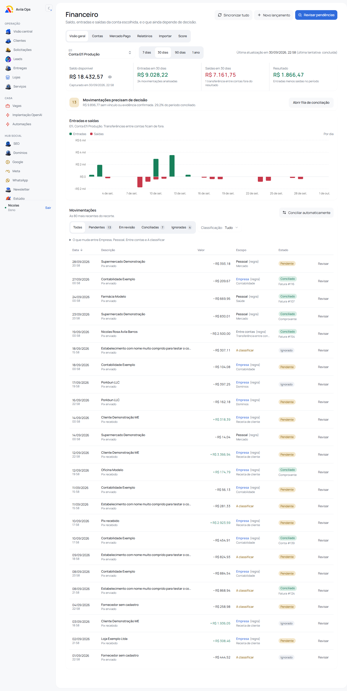
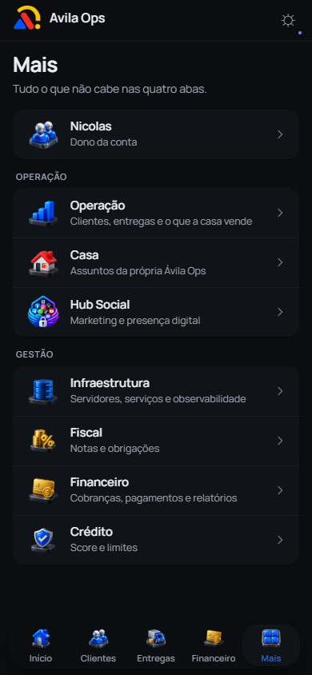
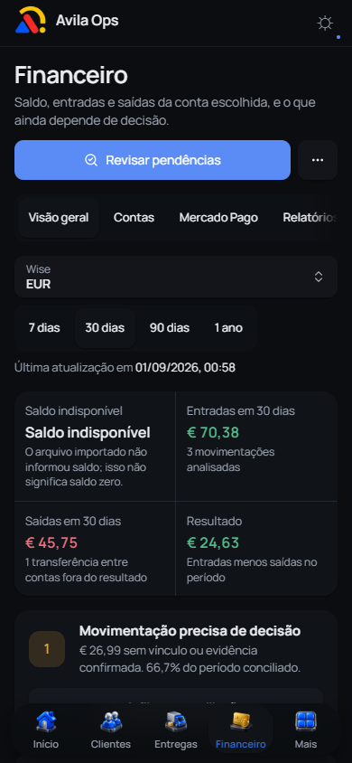
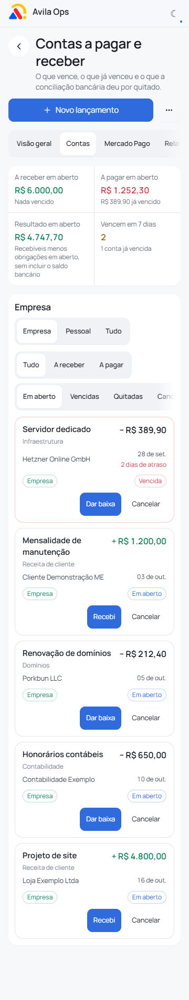
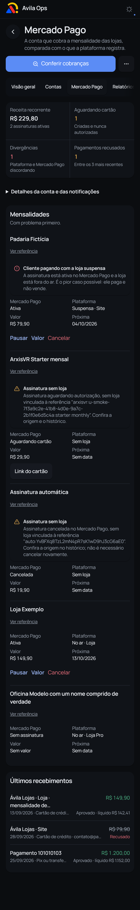
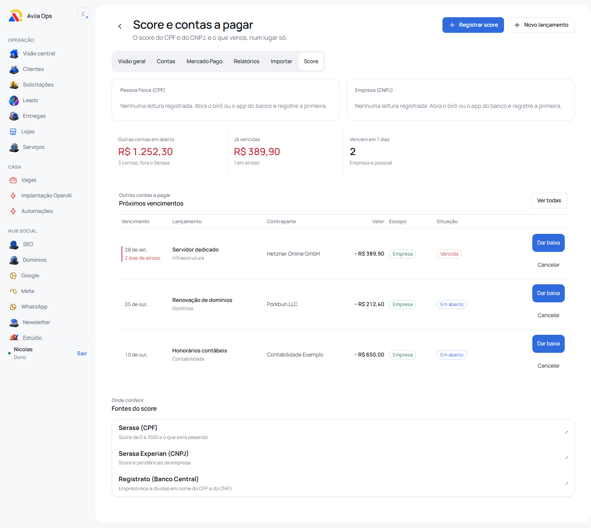
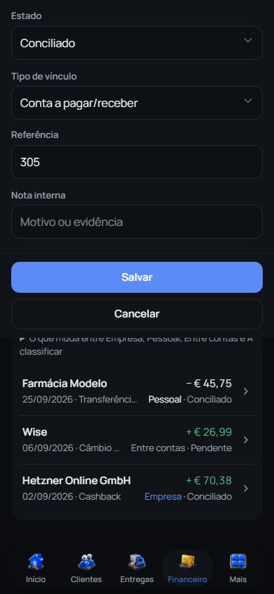
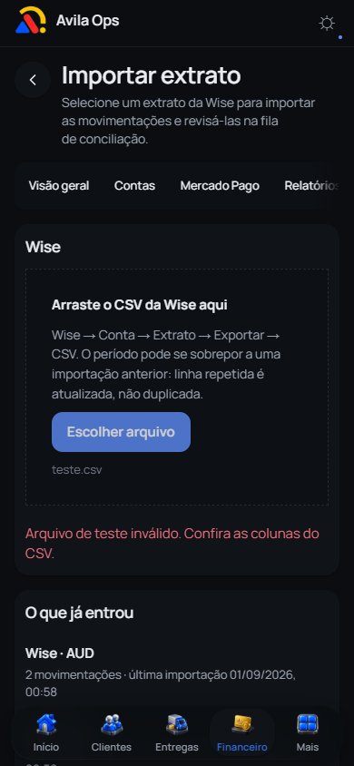
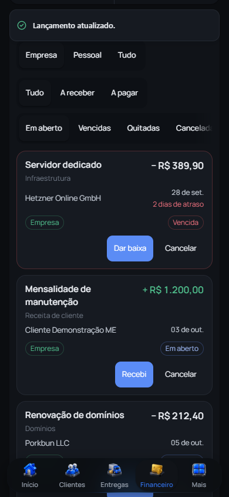

# Financeiro e identidade — finalização dos PRs #55 e #61

## O que mudou

O financeiro passa a usar o símbolo oficial, o nome Avila Ops e Manrope também
nos valores e no score. A navegação recebeu 16 PNGs transparentes da coleção
aprovada; o Hub Social usa a referência com redes sociais e cadeado. Google,
Meta e WhatsApp conservaram seus desenhos. Os arquivos usados pelo app somam
aproximadamente 147 KB; os SVGs com bitmap incorporado não entram no bundle.

Cada página tem sua ação principal e acesso às outras páginas do financeiro.
Importação prioriza o arquivo, contas priorizam o novo lançamento, Mercado Pago
prioriza conferir cobranças e relatórios mantêm as exportações. Na visão geral,
revisar pendências ganha prioridade; sincronizar permanece no menu de ações.

O saldo ausente da Wise não parece saldo zero. Assinatura cancelada não recebe
orientação para cancelar outra vez. O comprovante informa que os dados são
digitados. O resultado em aberto explica que não inclui o saldo bancário.
Referências técnicas longas podem ser abertas também no celular. Botões de
baixa usam o componente compartilhado, com erro, carregamento e confirmação.

Não houve migração, modificação de contratos de API ou nova operação financeira.
As fórmulas, permissões, filtros, moedas e integrações foram preservados. A
agregação visual diária do gráfico já fazia parte do #61 e mantém seus testes.

## Relação entre os PRs

O #55 foi reconciliado com a main `e33eded`, preservando o cadastro e a lista de
clientes mais recentes. Seu escopo continua sendo a densidade no celular e o
contraste dos controles do cadastro. O #61 incorpora essa base; a ordem de
integração é #55 e depois #61, revalidando o segundo contra a main atualizada.

## Ambiente das evidências

Build de produção local, PostgreSQL descartável na porta 55439, fixtures de
`scripts/prints/semear.ts` e `seed-visual.mjs`. O Mercado Pago e a plataforma de
lojas usam `mock-fetch.mjs`. A importação e as respostas de baixa no roteiro de
interação são interceptadas no navegador: nenhuma cobrança, cancelamento,
baixa ou conciliação de produção foi executada.

`conferir.mjs` verifica os temas, erros de console, largura dos elementos e o
fim do conteúdo acima da barra inferior. A foto de página inteira omite apenas
a barra fixa para não desenhá-la no meio; as fotos `-fim` usam a barra real.
`interacoes.mjs` cobre busca e seleção de conta, EUR, saldo ausente, lista vazia,
revisão, foco, Escape, erro de importação, retorno da baixa e carregamento dos
ícones. O teclado é simulado reduzindo `visualViewport`; iPhone físico e
integrações financeiras reais não foram testados.

## Resultados locais em 01/10/2026

- Instalação pelo lockfile e geração do Prisma concluídas.
- Lint: zero erros e sete avisos preexistentes; últimos scripts também sem erros.
- Typecheck e build de produção passaram; build repetido após os ajustes visuais.
  Heap de 4 GB. Avisos existentes de abrangência de arquivos do Turbopack não
  foram suprimidos.
- 540 testes em 46 arquivos passaram, incluindo quatro regressões de texto
  para assinaturas autorizadas, pendentes, pausadas e canceladas.
- Oito rotas (seis financeiras, Mais e Hub Social), quatro larguras (360, 390,
  768, 1440), dois temas: 64 combinações sem erro de console, corte horizontal
  ou conteúdo final escondido. Após corrigir a cor dos links usados como botão,
  Financeiro e Relatórios foram novamente conferidos no tema claro nas quatro
  larguras, sem problemas.
- As sete verificações de interação de `interacoes.mjs` passaram. Os ícones
  visíveis foram rolados para a tela e decodificados, respeitando o carregamento
  sob demanda; elementos da navegação desktop ocultos no celular não são
  confundidos com imagens quebradas.

## Capturas selecionadas

## CI e integração

A execução anterior do GitHub Actions não iniciava os jobs por cobrança/limite
da conta. Em 01/10, o runner voltou a executar os jobs após atualizar o #55.
Os testes locais não substituem os checks exigidos: merge e deploy dependem
dos checks verdes no commit final, sem contornar proteções.

### Dependência real da publicação

Na conferência por SSH em 01/10/2026, `app-avilaops-app-1` informou `GIT_SHA=370a57f`.
Essa versão contém o Núcleo (`bffbfc7`, PR #54) e Publicações (`4612828`, PR #56),
ainda fora da main. A comparação de árvores confirma que não são apenas hashes
diferentes: a main não contém rotas, modelos e componentes dessas duas frentes.
Os commits de clientes já têm patches equivalentes na main.

`DEPLOY_ENABLED=true` ativa a publicação automática após merge. Integrar e
publicar a main sem tratar essa dependência retiraria funcionalidades existentes.
As mudanças de núcleo, banco e publicações não foram misturadas ao #61, que
permanece de apresentação. É preciso resolver essa sequência de publicação
antes de liberar o merge que dispara o deploy, ou pausar esse deploy de forma
explicitamente combinada. Nenhuma configuração de produção foi alterada.
